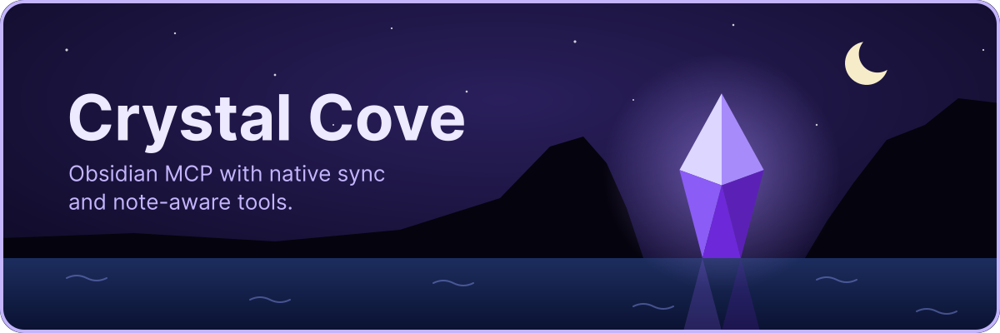
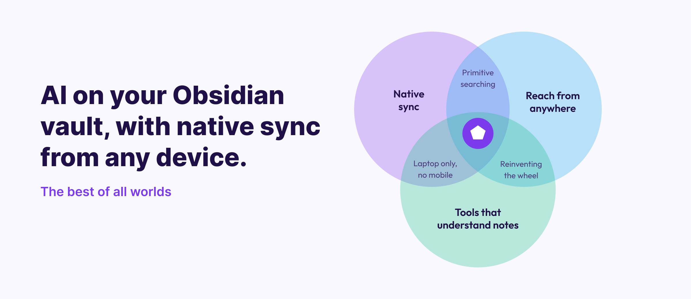

<p align="center">
  
</p>

<h1 align="center">Crystal Cove</h1>

<p align="center">
  Turn-key to run in a Docker container to work easily locally on your laptop or as a remote cloud connector like on claude.ai.
</p>


<p align="center">
  <a href="https://github.com/dakotahp/crystal-cove/actions/workflows/ci.yml"></a>
  <a href="https://github.com/dakotahp/crystal-cove/pkgs/container/crystal-cove"></a>
  <a href="LICENSE"></a>
</p>

<!-- toc -->

- [The Why](#the-why)
- [Use Cases](#use-cases)
  - [Which setup do you need?](#which-setup-do-you-need)
- [Installation](#installation)
  - [Local](#local)
  - [Remote](#remote)
- [What agents can do](#what-agents-can-do)
- [More docs](#more-docs)

<!-- /toc -->

## The Why

<p align="center">
  
</p>

Obsidian offers a CLI that requires the desktop app, or a headless sync service. But there is no first-party solution to give an agent access to your vault on a cloud server.

Giving an AI assistant real access to an Obsidian vault needs three things at once, and most others provide only two of them.

1. **Uses official sync engine.** Obsidian's own [headless client](https://help.obsidian.md/install/headless) is tried and true, so nothing here reimplements Obsidian Sync, and nothing depends on the desktop app being awake or on a socket into it.
2. **Reach from anywhere.** It speaks the [Model Context Protocol](https://modelcontextprotocol.io) over HTTP with secure authentication, so a browser, a phone, or a cloud agent can use it securely.
3. **Tools that understand notes.** An Obsidian vault is not simply a directory of markdown files, so a proper MCP layer provides tools that work with how Obsidian works. Not `read_file` and `list_directory` over a folder that waste tokens and make it difficult for agents to operate.

Each component involves very different things so this project is a Docker container that runs them cohesively for stability and security.

That means:

- **Claude** (claude.ai, Claude Code, Claude Desktop) and **ChatGPT**
  (connectors / deep research) can read, search, create, edit, and organize your notes quickly and efficiently.
- Every write syncs back to your Obsidian apps within seconds, and every note you jot down on your phone becomes visible to your assistant.
- It runs 24/7 wherever you host containers: a NAS, a VPS, Kubernetes, or a Raspberry Pi (images are amd64 + arm64).

## Use Cases

The project serves two use cases effectively:

1. Run locally on your laptop in lieu of using the Obsidian CLI with its idiosyncrasies.
2. Run as a cloud connector on your own server to give Claude or ChatGPT access to your notes from anywhere on any device, including your phone on-the-go. No native apps required.

### Which setup do you need?

The same container covers two distinct uses, and the tools are the same to an agent either way. The only difference is that running this locally on a laptop or desktop does not involve more complex OAuth authentication or a domain name.

|                  | **Locally**                                                  | **On a server**                                              |
| ---------------- | ------------------------------------------------------------ | ------------------------------------------------------------ |
| Example usage    | Agents on that machine: Claude Code, Cursor, and other local MCP clients | claude.ai in a browser, the Claude mobile app, and coding agents like Claude Code and Codex. |
| Example endpoint | `http://127.0.0.1:8080/`                                     | `https://obsidian.example.com/`                              |
| Authorization    | A static bearer token you generate                           | OAuth is required because claude.ai cannot send a fixed token |
| What you need    | Docker                                                       | A domain name, TLS, and a reverse proxy                      |
| Good for         | Daily agent work on a laptop or work computer, in place of a plugin or the Obsidian CLI, with no desktop app running | Reaching your vault from a phone, and agents that run while your computer is off |

Both keep the vault in sync through native Obsidian Sync, so a note written by an agent on one machine appears on your phone and your desktop like any other edit. Even if you also have the desktop app on the same computer running this service. Notes will sync up to Obsidian and then back down to your native apps.

## Installation

Any usage of this project requires Docker and an [Obsidian Sync](https://obsidian.md/sync) subscription. Multi-factor authentication and an end-to-end encryption password for your vault are supported.

Regardless of where you run the service (locally or remotely), the first step is configuring authentication. Clone this repository, then create a `.env` file next to `docker-compose.yml` with the following values or copy the [example file](.env.example):

```sh
# You ONLY need option A OR B, not both. Comment out one or the other with # in front to disable the respective one.

## Option A: when your Obsidian Sync account does NOT have MFA
OBSIDIAN_EMAIL=you@example.com
OBSIDIAN_PASSWORD=your-account-password

## Option B: when your Obsidian Sync account DOES have MFA
OBSIDIAN_AUTH_TOKEN=

# Set to the name of your vault that Obsidian Sync knows
OBSIDIAN_VAULTS=Default

# Only if the vault has an end-to-end encryption password
#OBSIDIAN_VAULT_PASSWORD=
```

Option A with email and password is self-explanatory. If your account has MFA (multi-factor authentication) enabled, use option B. Log in once on *any* machine with the official headless client and answer the MFA prompt, then copy the token it saved:

```sh
npx -y obsidian-headless login
cat ~/.obsidian-headless/auth_token          # macOS
cat ~/.config/obsidian-headless/auth_token   # Linux
```

The container then skips logging in and uses that session. Repeat the step if the token ever stops working.

Not sure of the vault's name? `OBSIDIAN_AUTH_TOKEN=... npx -y obsidian-headless sync-list-remote --json` lists your vaults as Obsidian Sync spells them.

Now follow the section for where you run it.

### Local

**1. Add a token for your agents** to `.env`. Agents send it with every request, so other programs on your computer cannot use the server.

```sh
# Paste the output of: openssl rand -hex 32
MCP_AUTH_TOKEN=
```

**2. Start it and wait for the first sync:**

```sh
docker compose up -d
docker compose logs -f          # wait for "Fully synced", then Ctrl-C
curl -s -o /dev/null -w '%{http_code}\n' http://127.0.0.1:8080/ready   # 200
```

The first sync downloads the whole vault into a Docker volume, so a large vault takes a few minutes. Set `PORT` in `.env` if 8080 is already taken.

**3. Point an agent at it.** For Claude Code:

```sh
claude mcp add --scope user --transport http obsidian http://127.0.0.1:8080/ \
  --header "Authorization: Bearer $MCP_AUTH_TOKEN"
```

`--scope user` makes the vault available in every folder. Avoid `--scope project`: it writes the token into a `.mcp.json` file that is meant to be committed. Then `claude mcp list` should show it connected.

Other MCP clients take the same URL and `Authorization` header over "Streamable HTTP".

**Stopping:** `docker compose stop` keeps the synced copy for next time. `docker compose down -v` also deletes it, so the next start re-syncs from scratch.

**On a work computer:** the container keeps a full copy of the vault on that machine, and it stays a registered Obsidian Sync device until you remove it.

### Remote

Do this when you want your vault from a phone, from claude.ai in a browser, or from agents that run while your computer is off.

**1. Pick a host** that can run a container and be reached over HTTPS. TLS is required, because tokens travel in a header. A reverse proxy (Caddy, Traefik, nginx), a platform ingress, or a [Cloudflare Tunnel](https://developers.cloudflare.com/cloudflare-one/connections/connect-networks/) all work. Point it at `127.0.0.1:8080`, where the container speaks plain HTTP. Do not set `BIND_ADDRESS=0.0.0.0`: that exposes the endpoint directly, without TLS.

**2. Give the server its own sync login.** Run the `npx -y obsidian-headless login` step above on the server, so it has a token of its own. A new login does not sign out your other devices. Also name the device, so Obsidian Sync version history shows which edits came from the server:

```sh
OBSIDIAN_DEVICE_NAME=crystal-cove
```

**3. Set up OAuth.** claude.ai and the Claude mobile app cannot send a fixed token, so they need an OAuth sign-in. Either point Crystal Cove at an identity provider you run, or put a small OAuth shim in front of it. [docs/oauth.md](docs/oauth.md) explains both. With an identity provider, add:

```sh
OAUTH_ISSUER=https://auth.example.com/realms/myrealm
OAUTH_AUDIENCE=crystal-cove
MCP_PUBLIC_URL=https://obsidian.example.com
OAUTH_REQUIRED_ROLES=vault-owner
```

Keep an `MCP_AUTH_TOKEN` too if you also want to connect Claude Code or scripts with a plain token.

**4. Start it and wait for the first sync:**

```sh
docker compose up -d
docker compose logs -f          # wait for "Fully synced", then Ctrl-C
curl -s -o /dev/null -w '%{http_code}\n' https://obsidian.example.com/ready   # 200
```

**5. Connect your assistant.**

- **claude.ai / Claude Desktop / Claude mobile:** add a custom connector with URL `https://obsidian.example.com/`. It finds the OAuth flow and signs you in.
- **ChatGPT:** add an MCP connector (Settings → Connectors) with the same URL.
- **Claude Code:** the same `claude mcp add` command as the local setup, with your server's URL.

If you plan to use it hands-free, for example in a car, set the write tools to "Always allow". A tool approval prompt may not be answerable there.

**Before you trust it:** the server can create, edit, move, and delete notes. Deletes only move notes to the vault's `.trash`, but start with a test vault until you trust your setup. Run one copy of the container per vault set: two sync processes on the same vault fight over it. [docs/operations.md](docs/operations.md) covers health checks and how the server recovers from sync failures.

## What agents can do

Agents get tools that work with notes, not raw files:

- **Read:** `read_note`, `get_section`, `get_frontmatter`, `list_notes`, `recent_notes`
- **Find:** `search_notes` (by name and content, ranked), `find_notes` (by tags and frontmatter), `list_tags`, `get_links`, `get_backlinks`
- **Write:** `create_note`, `append_note`, `edit_note`, `replace_section`, `update_frontmatter`, `move_note`, `delete_note`, `restore_note`

Deletes are soft: notes move to the vault's `.trash` and stay recoverable. Set `MCP_READ_ONLY=true` to give agents only the read and find tools. See [docs/tools.md](docs/tools.md) for every tool's details.

You can also give agents guidance about your vault, like an AGENTS.md file. Put it in a note called `mcp-instructions.md` at the vault root. See [docs/vault-instructions.md](docs/vault-instructions.md).

## More docs

- [Configuration](docs/configuration.md): every environment variable
- [OAuth](docs/oauth.md): signing in from claude.ai and ChatGPT
- [MCP tools](docs/tools.md): what each tool does
- [Vault instructions](docs/vault-instructions.md): guidance for agents
- [Operations](docs/operations.md): health checks, recovery, and running without Compose
- [Contributing](docs/CONTRIBUTING.md): developing this project
- [Security](docs/SECURITY.md): how the server protects your vault

---

*Obsidian is a trademark of Dynalist Inc. This project is not affiliated
with or endorsed by Obsidian; it simply drives the official headless sync client.*
